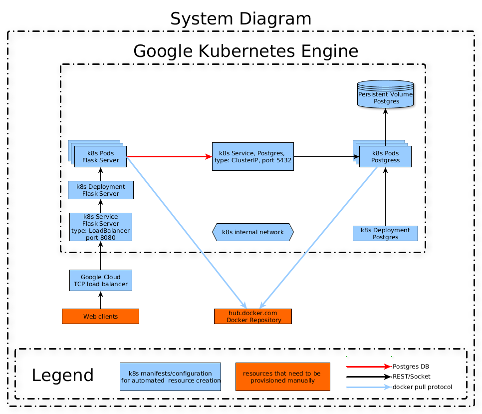

# Home Task - SRE/DevOps Engineer

### Build and push the image to Docker Hub

```bash
sudo make all
```

### Docker Compose

Build the images and spin up the containers:

```bash
sudo docker-compose up -d --build
```

(Optional) Recreate the database:

```bash
sudo docker-compose exec server python manage.py recreate_db
```

Test it out at:

```bash
curl http://localhost:8080/hello/user -d '{"dateOfBirth":"2018-08-12"}' -H "Content-Type: application/json" -X PUT -v
*   Trying 127.0.0.1...
* TCP_NODELAY set
* Connected to localhost (127.0.0.1) port 8080 (#0)
> PUT /hello/user HTTP/1.1
> Host: localhost:8080
> User-Agent: curl/7.58.0
> Accept: */*
> Content-Type: application/json
> Content-Length: 28
> 
* upload completely sent off: 28 out of 28 bytes
< HTTP/1.1 204 NO CONTENT
< Server: gunicorn/19.9.0
< Date: Mon, 12 Aug 2019 11:47:20 GMT
< Connection: close
< Content-Type: application/json
< Access-Control-Allow-Origin: *
< 
* Closing connection 0
```

```bash
curl http://localhost:8080/hello/user -v
*   Trying 127.0.0.1...
* TCP_NODELAY set
* Connected to localhost (127.0.0.1) port 8080 (#0)
> GET /hello/user HTTP/1.1
> Host: localhost:8080
> User-Agent: curl/7.58.0
> Accept: */*
> 
< HTTP/1.1 200 OK
< Server: gunicorn/19.9.0
< Date: Mon, 12 Aug 2019 11:48:08 GMT
< Connection: close
< Content-Type: application/json
< Content-Length: 44
< Access-Control-Allow-Origin: *
< 
{"message": "Hello, user! Happy birthday!"}
* Closing connection 0
```

1. [http://localhost:8080/hello/user](http://localhost:8080/hello/user)
1. [http://localhost:8080/healthz](http://localhost:8080/healthz)
1. [http://localhost:8080/readiness](http://localhost:8080/readiness)
1. [http://localhost:8080/metrics](http://localhost:8080/metrics)

Stop and remove containers, networks, images, and volumes:

```bash
sudo docker-compose down
```

### [Google Kubernetes Engine](https://cloud.google.com/kubernetes-engine/)


1. Install [Google Cloud SDK](https://cloud.google.com/sdk/install) Command-line interface for Google Cloud Platform products and services.
1. You need to configure both [auth application-default login](https://cloud.google.com/sdk/gcloud/reference/auth/application-default/) and [auth login](https://cloud.google.com/sdk/gcloud/reference/auth/login)
1. After installing Google Cloud SDK you should have [kubectl](https://kubernetes.io/docs/tasks/tools/install-kubectl/) configured.

> Once you authenticated successfully, credentials are preserved.
To see a list of components that are available and currently installed, run [gcloud components list](https://cloud.google.com/sdk/gcloud/reference/components/list)

```bash
┌────────────────────────────────────────────────────────────────────────────────────────────────────────────┐
│                                                 Components                                                 │
├───────────────┬──────────────────────────────────────────────────────┬──────────────────────────┬──────────┤
│     Status    │                         Name                         │            ID            │   Size   │
├───────────────┼──────────────────────────────────────────────────────┼──────────────────────────┼──────────┤
│ Installed     │ Cloud Storage Command Line Tool                      │ gsutil                   │  3.6 MiB │
│ Installed     │ gcloud Alpha Commands                                │ alpha                    │  < 1 MiB │
│ Installed     │ gcloud Beta Commands                                 │ beta                     │  < 1 MiB │
│ Installed     │ kubectl                                              │ kubectl                  │  < 1 MiB │
└───────────────┴──────────────────────────────────────────────────────┴──────────────────────────┴──────────┘
```

```bash
gcloud auth application-default login; gcloud auth login;
```

Start the cluster:

```bash
gcloud beta container clusters create "standard-cluster-2" \
 --machine-type "n1-standard-2" --image-type "COS" \
 --disk-type "pd-standard" --disk-size "100" \
 --preemptible --num-nodes "3" \
 --addons HorizontalPodAutoscaling,HttpLoadBalancing
```

#### Volume

Create the volume claim:

```bash
kubectl apply -f ./kubernetes/persistent-volume-claim.yml
```

#### Secrets

Create the secret object:

```bash
kubectl apply -f ./kubernetes/secret.yml
```

#### Postgres

> Production HA-Postgres could be installed via [helm chart](https://github.com/helm/charts/tree/master/stable/postgresql), but we will use simplified deployment version

Create deployment:

```bash
kubectl create -f ./kubernetes/postgres-deployment.yml
```

Create the service:

```bash
kubectl create -f ./kubernetes/postgres-service.yml
```

#### Flask


Create the deployment:

```bash
kubectl create -f ./kubernetes/flask-deployment.yml
```

(Optional) Drop all entries in the database and recreate tables:

```bash
kubectl exec deployment.apps/server --stdin --tty -- python manage.py recreate_db
```

Create the service:

```bash
kubectl create -f ./kubernetes/flask-service.yml
```

Try it out:

```bash
export EXTERNAL_IP=`kubectl get services server --output jsonpath='{.status.loadBalancer.ingress[0].ip}'`

curl http://$EXTERNAL_IP/hello/user -d '{"dateOfBirth":"2018-08-12"}' -H "Content-Type: application/json" -X PUT -v
curl http://$EXTERNAL_IP/hello/user -v
curl http://$EXTERNAL_IP/healthz -v
curl http://$EXTERNAL_IP/metrics -v
curl http://$EXTERNAL_IP/readiness -v
```

To remove all deployments:

```bash
kubectl delete -f kubernetes/
```
